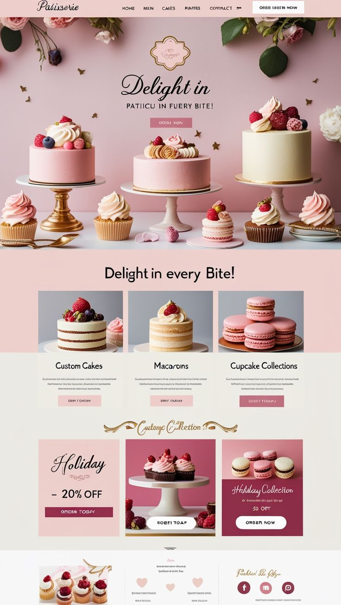

#  Patisserie UI Challenge

A front‑end project created to mimic a luxury patisserie/bakery landing page design.  
The goal was to reproduce the elegant aesthetic of the reference image — pink floral accents, gold highlights, and a showcase of cakes, cupcakes, and macarons — using modern web technologies.

---

## Preview 


---

## Features
- **Hero Section** with tagline and call‑to‑action buttons.
- **Menu Navigation**: Cakes, Parties, Contact.
- **Product Highlights**: Custom Cakes, Macarons, Cupcake Collection
- **Advertisment**: Holiday Collection with 20% OFF banner.
- **Responsive Layout** for desktop and mobile.
- **Elegant Styling** inspired by patisserie branding.

---

##  Tech Stack
- **HTML** & **CSS3** for structure and styling.
- **React ts** for interactivity.
- **Vercel** for deployment and hosting.
- **Vite**

---
## Prerequisites
Before you begin, ensure you have the following installed:

Node.js (v18 or later recommended)
npm (comes with Node.js)

You can verify your installation by running:

```bash
node -v
npm -v
```

##  Getting Started

Follow these steps to run the project locally:

1. **Clone the repository**
   ```bash
   git clone https://github.com/Lutricia-The-Coder/UI-Challenge.git
   cd UI-Challenge

2. Install dependencies
   ```bash
   npm install

4. Run the development server
   ```bash
   npm run dev

Vite will start the application and display something similar to:

```
Local: http://localhost:5173
```

 see the live site  check **ui-challenge-drab.vercel.app**

### Useful Resources

* React Documentation - Comprehensive guide for React concepts
* TypeScript Handbook - Official TypeScript learning resources
* Vite Docs - Fast build tool and dev server documentation
* Hugeicons - Icon library used for navigation and UI elements
* Frontend Mentor - For realistic front-end development challenges

## Author
**Lutricia Ngomane**
